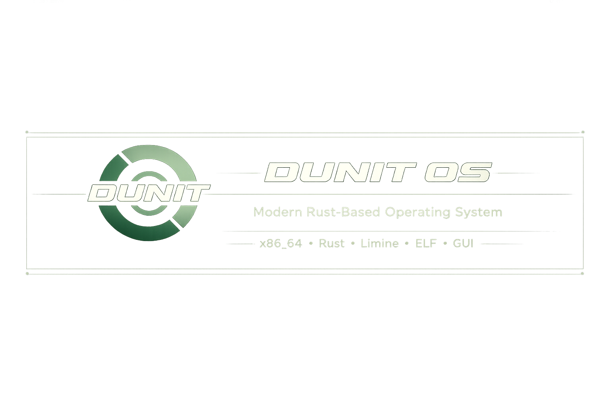

<p align="center">
  
</p>

# Dunit OS

Dunit OS is a small x86_64 hobby operating system built around a Rust kernel,
a C/NASM hardware layer, a Limine boot flow, and a growing userspace runtime.

It is not a polished desktop OS yet. The current system is a terminal-first OS
prototype with real userspace ELF execution, a memory-backed filesystem,
syscalls, process records, recoverable userspace faults, and cooperative
userspace child scheduling.

## Current State

What works today:

- Limine boot with Terminal Mode first and GUI Mode still available.ч
- HAL in C/NASM: GDT, IDT, interrupt entry, syscall entry, context switch stubs,
  port I/O, and low-level boot handoff.
- Rust `no_std` kernel with PMM, VMM, heap, address-space setup, and basic fault
  recovery for userspace.
- Framebuffer-backed kernel terminal with command parsing, history, autocomplete,
  and honest system commands.
- VFS with MemFS as the root filesystem.
- `/app` userspace ELF binaries embedded into MemFS.
- `/assets` mirrors the repository asset tree, including images, icons, GUI files,
  wallpapers, fonts, and boot art.
- Userspace syscall ABI for read/write/open/close, framebuffer drawing,
  spawn/wait, pid, cwd/chdir, sleep, debug log, readdir/stat, process stats,
  IPC, stdin, and cooperative yield.
- Userspace exec ABI with `argc`, `argv`, and `envp`.
- PATH lookup through `/app`, so both `exec /app/elf_demo` and `exec elf_demo`
  style commands are supported.
- stdio fd foundation: stdin returns EOF, stdout/stderr write to the terminal log.
- Process table with real records, parent/child relation, wait/reap behavior,
  terminal exec autoreap, exit codes, and fault statuses.
- Runnable spawn/yield foundation: `spawn` prepares an ELF child into Ready
  state, and `yield` can run Ready children and resume the parent.
- Cooperative scheduler foundation: validated PID ready queue, userspace context
  save/restore, and wait/reap status reporting.
- Minimal `/proc`, `/dev`, and RAM-backed `ramblk0` block diagnostics.

## Included Userspace Apps

Current system apps in `/app`:

- `elf_demo` - minimal userspace hello-world.
- `fs_test` - VFS syscall smoke test.
- `exit_test` - process exit test.
- `args_test` - argv ABI test.
- `cwd_test` - getcwd/chdir ABI test.
- `path_test` - PATH and spawn/wait contract test.
- `stdin_test` - stdin EOF foundation test.
- `scheduler_test` - scheduler/yield foundation test.
- `spawn_ready_test` - runnable spawn foundation test.
- `yield_test` / `resumable_test` - cooperative child execution tests.
- `ipc_parent` / `ipc_child` - parent/child IPC round trip.
- `runtime_stress` - canonical runtime regression app.
- `image_demo` - framebuffer drawing demo.
- `bmp_viewer` - BMP renderer; defaults to `/assets/images/logo.bmp`.
- `gui_file_manager` - GUI File Manager MVP with real `readdir`/`stat`.
- `fault_pf` - recoverable page fault test.
- `fault_ud` - recoverable invalid opcode test.

Example terminal commands:

```text
help
dufetch
ls /app
ls /assets
exec args_test one two
exec bmp_viewer
exec bmp_viewer /assets/images/dr15.bmp
exec fault_pf
ps
pwd
```

## Architecture

```text
                 userspace Rust ELF apps
        args_test | fs_test | bmp_viewer | ...
                            |
                         libdunit
                            |
                  syscall ABI / exec ABI
                            |
                  Rust kernel subsystems
      process table | VFS/MemFS | ELF | PMM/VMM | terminal
                            |
                         C/NASM HAL
          boot handoff | GDT | IDT | interrupts | syscall entry
                            |
                         Limine/QEMU
```

The project is still early, but userspace process execution is now real enough
for foreground apps to spawn children, yield to them, resume, and wait for real
exit or fault status.

## Boot Modes

`limine.conf` is the normal interactive boot menu:

```text
timeout: 5

/Dunit OS - GUI Mode
    resolution: 1600x900x32

/Dunit OS - Terminal Mode
    cmdline: mode=terminal
```

Automated tests use separate configs so they never depend on the normal boot
menu:

- `limine_test_terminal.conf`: terminal mode, timeout 0.
- `limine_test_gui.conf`: GUI mode, timeout 0.

Terminal Mode is the reliable development path. GUI Mode exists, but it is not
the focus of the current runtime milestones.

## Honest Limitations

Not implemented yet:

- Hardened timer preemption.
- SMP.
- Disk-backed filesystem.
- Network stack.
- Userspace terminal/shell process.
- Full libc.
- ACPI/QEMU shutdown.
- Real RTC/date source.

Current foundation behavior:

- `spawn` prepares a Ready child.
- `yield` can switch to a Ready child and resume the parent.
- `wait` on Ready/Running children returns `EAGAIN`; after execution it reports
  real exit/fault status.
- Foreground terminal `stdin` can provide line input to userspace apps.
- `/assets` is embedded from the repository `assets/` directory with the same
  hierarchy exposed in MemFS.

## Roadmap

### 1. Userspace Runtime v1

- Stabilize `spawn/yield/wait/exit/fault/stdin/stdout/ipc` as a runtime contract.
- Use `runtime_stress` as the canonical QEMU regression app.
- Keep automated launch/testing behind `build_and_run_multipass.py`.
- Fix or document host-side kernel test workflow separately from QEMU runtime
  verification.

### 2. Runtime Contracts

- Tighten syscall error codes and userspace wrappers.
- Expand stdin beyond EOF-only behavior.
- Add better process introspection for `ps`.
- Keep fault diagnostics recoverable and readable.

### 3. Filesystem Growth

- Move beyond embedded MemFS assets.
- Add a disk-backed filesystem path.
- Add mount/unmount semantics.
- Keep `/app` and `/assets` as early boot/system locations.

### 4. Terminal And Tools

- Make terminal commands less kernel-hardcoded over time.
- Add more userspace tools.
- Add file inspection/editing primitives.
- Improve automated regression coverage.

### 5. GUI Later

- Revisit GUI mode after scheduler/runtime contracts are strong.
- Prefer real userspace GUI processes over fake desktop state.
- Add input, rendering, and window/compositor contracts gradually.

## Repository Map

```text
hal/                         C/NASM hardware layer
kernel/                      Rust no_std kernel
userspace/libdunit/          Userspace syscall/startup helper library
userspace/system_apps/       Small Rust ELF apps embedded into /app
docs/                        Design notes and milestone context
build_and_run_multipass.py   Canonical build/test/run automation
limine.conf                  Normal interactive boot menu
limine_test_terminal.conf    Automated terminal test boot config
limine_test_gui.conf         Automated GUI test boot config
```

## License

MIT License.

## made with rust
