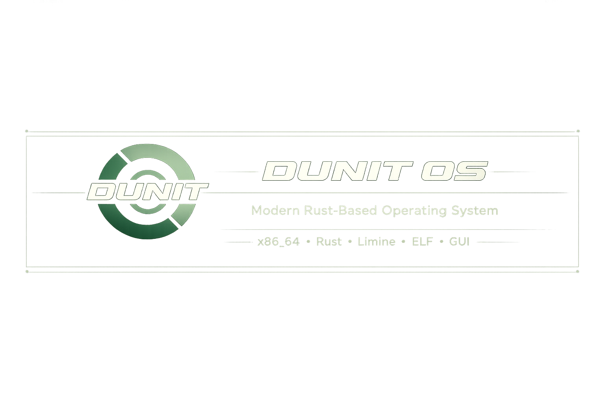

<p align="center">
  
</p>

# Dunit OS

Dunit OS is a from-scratch x86_64 operating system: a Rust `no_std` kernel (the
**Green Tea Kernel**), a C/NASM hardware layer, a Limine BIOS/UEFI boot flow, its
own stable userspace ABI, and a userspace GUI stack. The design rule is a strict
split — **the kernel provides mechanisms, userspace provides policy**: processes
are independent ring-3 ELF binaries, the window manager/compositor and all apps
live in userspace, and configuration (not Rust code) drives the desktop.

POSIX and musl are treated as a *source-portability layer*, not a goal of Linux
compatibility — the kernel speaks its own native syscall ABI, and a dedicated
musl fork is being ported onto it (see [The Dunit musl port](#the-dunit-musl-port)).

It is a hobby OS, not a production desktop — but it boots on BIOS and UEFI, runs
preemptive multithreaded userspace processes with crash isolation, has a
config-driven desktop, installs to a real disk with a persistent filesystem, and
now runs static C programs built against its own ported libc.

## Current State

### Kernel & runtime
- Limine boot on **BIOS and UEFI**, with a Terminal Mode and a GUI/DWM Mode.
- C/NASM HAL: GDT, IDT, interrupt + syscall entry, context switch, PIT timer,
  port I/O, FS-base MSR, boot handoff.
- Rust `no_std` kernel with PMM, VMM, kernel heap, per-process address spaces,
  and recoverable userspace faults (a faulting app is killed, the system lives).
- Ring-3 ELF processes with real process records, parent/child, wait/reap, exit
  codes and fault statuses.

### Scheduling, threads & sync (M1, done)
- **Preemptive** round-robin scheduler on the PIT (a CPU-bound child is
  preempted without yielding); FPU/SSE state saved across switches.
- Schedulable **threads**: per-thread TID, context, kernel stack and FPU state,
  sharing the owner process address space; `join` returns status; a thread fault
  is isolated.
- **Wait queues** with blocking sleep and IPC/event waits (no busy-polling).
- **TLS** ABI (x86_64 `FS.base`, Variant II TCB, `PT_TLS` image).
- Dunit-native **futex** (`FutexWait`/`FutexWake`): key = (owner pid, user vaddr),
  compare-and-park atomic under an IRQ guard + wait-queue lock (no lost wakeups).

### Memory & VM
- `mmap`/`munmap`/`mprotect`, anonymous mappings, guard pages, W^X enforcement,
  shared VM objects, and correct teardown returning frames to the PMM.

### IPC, handles & capabilities
- Message IPC with queues, shared-memory buffers, and a PTY subsystem.
- Per-process **handle table** with rights (`READ/WRITE/MAP/SIGNAL/TRANSFER/
  DISPLAY_MASTER`); rights can only narrow on `dup`/`transfer`; the display
  master is exclusive system-wide.

### Filesystem & storage (M5, done)
- VFS with a writable **MemFS** root; `/app` and `/assets` are populated from the
  Limine-loaded **initrd** archive (the kernel embeds no app binaries or assets).
- **AHCI** and **VirtIO** block drivers, GPT partitioning, and **DunitFS**.
- Bootable BIOS/UEFI **disk image**, plus an in-system installer that writes a
  real installation to an AHCI disk. A persistent DunitFS partition is mounted at
  **`/persist`** and survives reboots.
- Minimal `/proc`, `/dev`, and RAM block diagnostics.

### Kernel terminal
- Framebuffer-backed terminal with a Linux-TTY-style 8x16 VGA console font,
  command parsing, history, autocomplete, and honest system commands.

### Userspace GUI / Dunit DWM (M3-M4, done)
- `gui_server`: a **userspace** software compositor (damage tracking, focus and
  input routing) — there is no window-management policy in the kernel.
- Config-driven **Dunit DWM**: panel, dock, launcher, workspaces, widgets, quick
  settings, notifications, an Alt/Super window switcher, ARGB transparency, and
  protocol-driven resize/maximize — all driven by configuration, not hardcode.
- A declarative **UI Runtime** (`runtime/`, DUI + DSS) and the `gui-v1` wire
  protocol (`protocols/gui-v1`) with a headless reference server + host tests.
- GUI applications are independent userspace ELF clients (crash-isolated).

### Userspace ABI v0 (abi/)
- A single-source-of-truth ABI under `abi/`: `syscalls.abi`, `errno.abi`,
  `rights.abi` -> generated Rust (`libdunit`) **and** C headers
  (`abi/include/dunit/*.h`), with `tools/gen_abi.py` asserting the kernel agrees
  (drift is a hard error / CI gate).
- Native syscall convention (`rax`=number, `rdi/rsi/rdx/r10/r8/r9`), errno =
  negated POSIX magnitudes, a capability query (`sys_abi_query`), a SysV-style
  process-entry stack with an **auxv** (`AT_PAGESZ/AT_SECURE/AT_RANDOM`), and a
  static-first ELF contract (ELF64 LE `ET_EXEC`, `PT_LOAD` + `PT_TLS`).

## The Dunit musl port

M6 is a real port of **musl libc** onto the Green Tea Kernel's native ABI — not a
Linux-compat shim. The fork lives in its own repository and is wired in as the
git submodule `toolchains/dunit-musl` (auto-fetched by `build_iso.sh`/`make`):

- Upstream musl **v1.2.6** (`b1efda5b`), carried as a full fork with provenance
  (`UPSTREAM.md`) and a themed-commit porting plan (`PORTING.md`).
- Target `x86_64-dunit`: the host compiler is the cross compiler (the syscall
  instruction/registers already match Dunit); `tools/dunit/build-libc.sh` builds
  a static `libc.a` + crt objects into a sysroot.
- Linux syscall numbers are replaced with Dunit's; unmapped calls return a
  documented `-ENOSYS` (never a silent fake). The thread pointer, anonymous
  `mmap` (malloc), the stdio write path, and an `open` flag/arg adapter all map
  onto native Dunit syscalls.

Static musl programs that **run on the kernel today** (built into `/app`, checked
by `tools/m6_musl_*_markers.json`):

- `musl_hello` — crt1 + `__libc_start_main` + TLS setup + `write`.
- `musl_stdio` — `printf`/`fflush` (buffered stdio over native `Write`).
- `musl_malloc` — mallocng (small + 1 MiB `mmap` + `calloc` + `free`).
- `musl_file` — `open`/`read`/`write`/`close`, incl. a write+read roundtrip in `/persist`.
- `musl_thread` — two `pthread`s + a contended `pthread_mutex` + `pthread_join`.
- `musl_read` — buffered stdio reads (`fopen`/`fgets`/`fgetc` EOF).
- `musl_stat` — `stat()` of a file and a directory (type + size).
- `musl_dir` — `opendir`/`readdir`/`closedir` listing a directory.

Threads use the native `__clone`, a futex wait/wake dispatcher, and a kernel
clear-child-tid primitive (`SetTidAddress`) that releases musl's thread-list lock
on thread exit. The filesystem surface (open/read/write/close, `stat`, directory
iteration, buffered stdio) is complete; signals and networking are still
documented `ENOSYS`.

## Userspace apps

Apps are independent ELF binaries in `/app`, loaded from the initrd. A selection:

- **Runtime/ABI tests:** `elf_demo`, `fs_test`, `exit_test`, `args_test`,
  `cwd_test`, `path_test`, `env_test`, `file_api_test`, `stdin_test`, `abi_test`.
- **Scheduler/threads/VM:** `scheduler_test`, `preempt_test`, `yield_test`,
  `thread_test`, `wait_test`, `vm_test`, `vm_protect_fault`, `vm_guard_fault`,
  `tls_test`, `futex_test`, `handle_test`, `runtime_stress`.
- **IPC / processes:** `ipc_parent`/`ipc_child`, `spawn_ready_test`,
  `kill_target`, `pty_test`/`pty_echo`.
- **Faults (recoverable):** `fault_pf`, `fault_ud`.
- **GUI / desktop:** `gui_server`, `dtop` (DWM), `gui_files`, `gui_terminal`,
  `gui_calc`, `gui_stat`, `gui_settings`, `gui_client`/`gui_demo`.
- **Shell / tools:** `dsh`, `calc`, `init`, `fsck_dunit`.
- **Freestanding C & musl:** `c_hello` (ABI v0 conformance, no libc) and the
  `musl_*` programs above.

Example terminal commands:

```text
help
dufetch
ls /app
exec args_test one two
exec c_hello
exec musl_malloc
exec musl_file
ps
```

## Architecture

```text
      independent userspace ELF apps          static C / musl apps
  gui_files | gui_terminal | dsh | calc         musl_hello | musl_file
                   |                                    |
               libdunit (Rust)                  Dunit musl fork (libc.a)
                   \_______________   _________________/
                                   \ /
                 Dunit Userspace ABI v0  (abi/, generated)
                 native syscalls | process-entry+auxv | ELF
                                   |
                      gui_server (compositor/DWM)   <- userspace policy
                                   |
                   Green Tea Kernel (Rust no_std)   <- mechanisms
 process/threads | scheduler | VMM/PMM | VFS/MemFS/DunitFS | IPC/handles
                 display/input | AHCI/VirtIO | terminal | ELF loader
                                   |
                        C/NASM HAL (GDT/IDT/syscall/timer)
                                   |
                            Limine (BIOS/UEFI) / QEMU
```

## Build & run

Prerequisites: a host `gcc` (also used as the `x86_64-dunit` cross compiler),
`nasm`, `lld`, `xorriso`, `qemu-system-x86_64`, `python3`, and a Rust **nightly**
toolchain with `rust-src` (see `rust-toolchain.toml`).

```bash
git clone https://github.com/xssl9/dunit-os.git
cd dunit-os
./build_iso.sh          # fetches Limine + the dunit-musl submodule, builds the ISO
```

`build_iso.sh` and `make` auto-fetch the `toolchains/dunit-musl` submodule, so a
plain `git clone` (without `--recurse-submodules`) still builds the musl programs;
if git/network is unavailable they are skipped with a warning rather than failing.

Common targets:

```bash
make iso                # terminal-first ISO (build/microkernel.iso)
make iso-dwm            # desktop (DWM) ISO
make disk-image         # bootable BIOS/UEFI raw disk image (no root needed)
make run                # build + boot the ISO in QEMU
make run-dwm            # build + boot the desktop in QEMU
```

## Testing

`tools/qemu_test.py` is the single, fully-automatic build/boot/verify entrypoint:
it builds, boots QEMU headless, drives the terminal, and checks serial-log
markers. Marker contracts live in `tools/*_markers.json`.

```bash
python3 tools/qemu_test.py --build --cmd "exec runtime_stress"
python3 tools/qemu_test.py --build --markers-file tools/m6_musl_file_markers.json
```

## Boot modes

`limine.conf` is the normal interactive menu (GUI + Terminal). Automated tests use
dedicated zero-timeout configs so they never depend on the menu:

- `limine_test_terminal.conf` — terminal mode.
- `limine_test_gui.conf` — GUI mode.

## Install to a disk

Build a bootable BIOS/UEFI image without root:

```bash
make disk-image
```

Install to a whole physical disk (this **erases** the target — verify the device):

```bash
sudo python3 tools/install_disk.py /dev/sdX --yes-i-know-this-erases-the-disk
```

The installer writes a FAT32 EFI System Partition (Limine + kernel) and a
persistent DunitFS partition mounted at `/persist`. The live system can also
install itself from the Dunit terminal:

```text
lsblk
install.dunit sda --yes
```

## Honest limitations

Working but UP-only / early:
- Single-CPU (no SMP yet); the root filesystem is still MemFS (DunitFS is the
  persistent partition at `/persist`, not yet `/`).

Not implemented yet:
- Signals, dynamic TLS/DTV, and full `exec`/`fork`.
- In the musl port: signals and networking (the static C `hello`/`stdio`/
  `malloc`/`file`/`thread` suite and the open/read/write/stat/dir/stdio surface
  all run).
- Networking, audio, complete USB, and ACPI power/shutdown.
- A real RTC/date source; filesystem journaling/recovery.

## Repository map

```text
hal/                        C/NASM hardware layer
kernel/                     Rust no_std kernel (Green Tea Kernel)
abi/                        Userspace ABI v0: manifests + generated C headers
userspace/libdunit/         Rust userspace syscall/startup library
userspace/system_apps/      Rust ELF apps shipped in /app
userspace/ctests/           Freestanding C (c_hello) + static musl programs
toolchains/dunit-musl/      The Dunit musl fork (git submodule)
protocols/gui-v1/           GUI wire protocol + headless reference server
runtime/                    Declarative UI runtime (DUI/DSS)
assets/                     Images, icons, fonts, wallpapers, boot art
tools/qemu_test.py          Canonical build/test/run automation
tools/gen_abi.py            ABI manifest -> Rust/C generator + kernel check
DUNIT_OS_TECHNICAL_ROADMAP.md   Detailed architecture & milestones (M0-M7)
```

## Roadmap

Milestone status (full detail in `DUNIT_OS_TECHNICAL_ROADMAP.md`):

- **M0-M1** — contracts + kernel runtime (preemption, threads, TLS, futex, VM,
  handles): **done**.
- **M2-M4** — GUI protocol, userspace compositor, Dunit DWM + UI runtime: **done**.
- **M5** — installed system + persistence (AHCI/VirtIO, GPT, DunitFS, BIOS/UEFI
  install): **done**.
- **M6** — Dunit musl fork, static-first: **in progress** — the static C suite
  (`hello`/`stdio`/`malloc`/`file`/`thread`) runs on the kernel and the
  filesystem surface (open/read/write/stat/dir/stdio) is complete; signals and
  networking remain.
- **M7** — networking, audio, USB, ACPI, package platform: **later**.

## License

MIT License.

## made with rust


